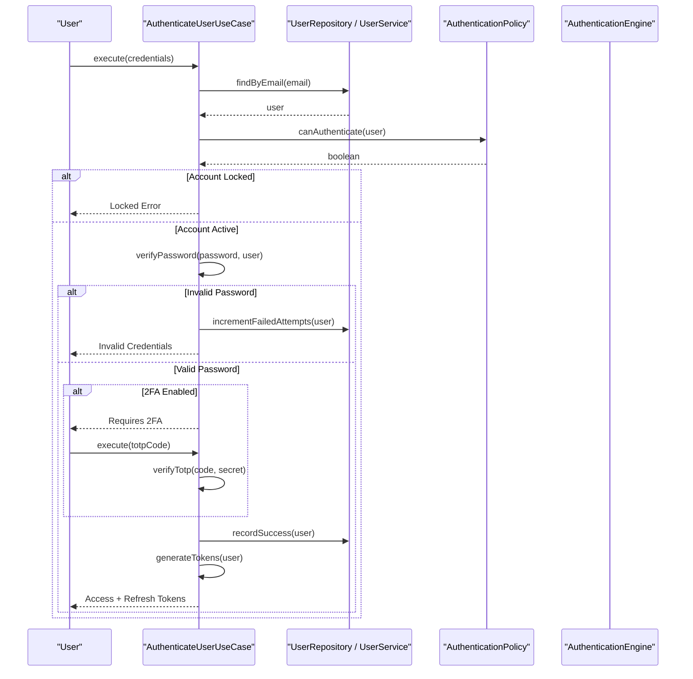

# Authentication Flow Sequence

```mermaid
sequenceDiagram
    participant U as "User"
    participant UC as "AuthenticateUserUseCase"
    participant REPO as "UserRepository / UserService"
    participant POLICY as "AuthenticationPolicy"
    participant AUTH as "AuthenticationEngine"

    U->>UC: execute(credentials)
    UC->>REPO: findByEmail(email)
    REPO-->>UC: user
    
    UC->>POLICY: canAuthenticate(user)
    POLICY-->>UC: boolean
    
    alt Account Locked
        UC-->>U: Locked Error
    else Account Active
        UC->>UC: verifyPassword(password, user)
        
        alt Invalid Password
            UC->>REPO: incrementFailedAttempts(user)
            UC-->>U: Invalid Credentials
        else Valid Password
            alt 2FA Enabled
                UC-->>U: Requires 2FA
                U->>UC: execute(totpCode)
                UC->>UC: verifyTotp(code, secret)
            end
            
            UC->>REPO: recordSuccess(user)
            UC->>UC: generateTokens(user)
            UC-->>U: Access + Refresh Tokens
        end
    end
```
