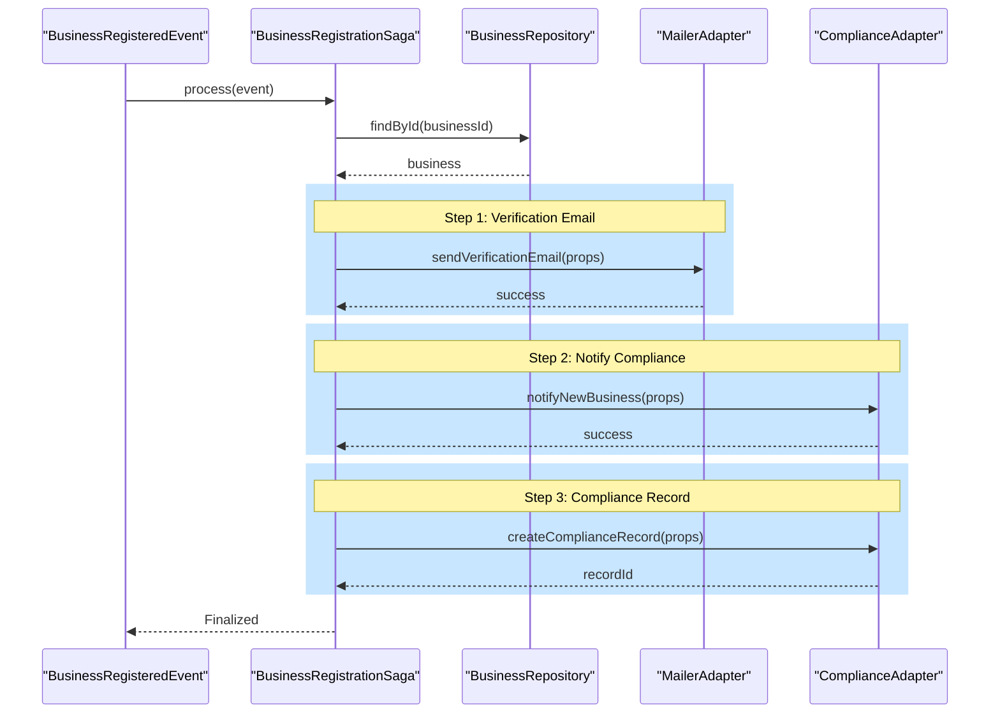

# Business Registration Saga Sequence

```mermaid
sequenceDiagram
    participant Event as "BusinessRegisteredEvent"
    participant Saga as "BusinessRegistrationSaga"
    participant Repo as "BusinessRepository"
    participant Mail as "MailerAdapter"
    participant Comp as "ComplianceAdapter"

    Event->>Saga: process(event)
    Saga->>Repo: findById(businessId)
    Repo-->>Saga: business
    
    rect rgb(200, 230, 255)
    Note over Saga, Mail: Step 1: Verification Email
    Saga->>Mail: sendVerificationEmail(props)
    Mail-->>Saga: success
    end

    rect rgb(200, 230, 255)
    Note over Saga, Comp: Step 2: Notify Compliance
    Saga->>Comp: notifyNewBusiness(props)
    Comp-->>Saga: success
    end

    rect rgb(200, 230, 255)
    Note over Saga, Comp: Step 3: Compliance Record
    Saga->>Comp: createComplianceRecord(props)
    Comp-->>Saga: recordId
    end

    Saga-->>Event: Finalized
```
