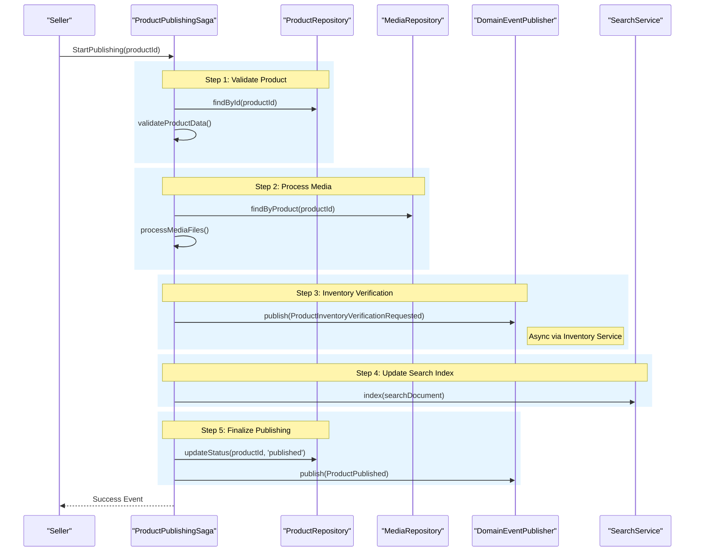

# Product Publishing Saga Sequence

```mermaid
sequenceDiagram
    participant S as "Seller"
    participant SAGA as "ProductPublishingSaga"
    participant REPO as "ProductRepository"
    participant MEDIA as "MediaRepository"
    participant EB as "DomainEventPublisher"
    participant SEARCH as "SearchService"

    S->>SAGA: StartPublishing(productId)
    
    rect rgb(230, 245, 255)
    Note over SAGA, REPO: Step 1: Validate Product
    SAGA->>REPO: findById(productId)
    SAGA->>SAGA: validateProductData()
    end

    rect rgb(230, 245, 255)
    Note over SAGA, MEDIA: Step 2: Process Media
    SAGA->>MEDIA: findByProduct(productId)
    SAGA->>SAGA: processMediaFiles()
    end

    rect rgb(230, 245, 255)
    Note over SAGA, EB: Step 3: Inventory Verification
    SAGA->>EB: publish(ProductInventoryVerificationRequested)
    Note right of EB: Async via Inventory Service
    end

    rect rgb(230, 245, 255)
    Note over SAGA, SEARCH: Step 4: Update Search Index
    SAGA->>SEARCH: index(searchDocument)
    end

    rect rgb(230, 245, 255)
    Note over SAGA, REPO: Step 5: Finalize Publishing
    SAGA->>REPO: updateStatus(productId, 'published')
    SAGA->>EB: publish(ProductPublished)
    end

    SAGA-->>S: Success Event
```
