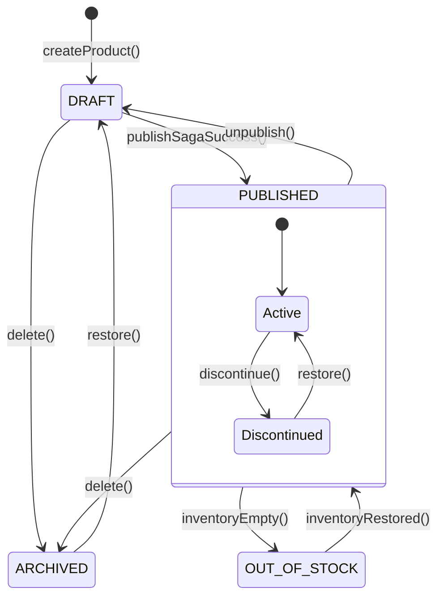

# Product Status State Machine

```mermaid
stateDiagram-v2
    [*] --> DRAFT : createProduct()
    DRAFT --> PUBLISHED : publishSagaSuccess()
    DRAFT --> ARCHIVED : delete()
    PUBLISHED --> DRAFT : unpublish()
    PUBLISHED --> OUT_OF_STOCK : inventoryEmpty()
    OUT_OF_STOCK --> PUBLISHED : inventoryRestored()
    PUBLISHED --> ARCHIVED : delete()
    ARCHIVED --> DRAFT : restore()
    
    state PUBLISHED {
        [*] --> Active
        Active --> Discontinued : discontinue()
        Discontinued --> Active : restore()
    }
```
