# Maysar Express — Complete Database Relationship Diagrams

> **Complete schema coverage** — all 80+ models from `prisma/schema.prisma` (read in full).
> Organised by service domain. Each diagram shows actual fields, types, and relations.

---

## Domain Index

| # | Domain | Models |
|---|--------|--------|
| 1 | [Auth & Session](#1-auth--session) | User, Auth_User, Session, AuditLog, Auth_RoleRequest, Auth_UserIndex, Auth_PasswordResetToken, Auth_EmailVerificationToken, User_TwoFactorAuth |
| 2 | [User Service](#2-user-service) | User_User, User_CODHistory, User_UserAddress, User_Session, User_PasswordResetToken, User_EmailVerificationToken, User_AuditLog, User_UserIndex |
| 3 | [Business Registry](#3-business-registry) | Business, BusinessAddress, BusinessDocument, BusinessRegistry_ComplianceRecord |
| 4 | [Catalog](#4-catalog) | Category, Product, ProductVariant, BuyBox, Catalog_BuyBoxAlternative, MediaRef, CategoryAttribute, ProductAttribute, Catalog_ProductReview, Catalog_ReviewModerationLog, Catalog_ProductMatchAudit, Catalog_MatchConfirmation |
| 5 | [Checkout](#5-checkout) | Checkout_Cart, Checkout_CartItem, Checkout_CheckoutSession, Checkout_Order, Checkout_OrderItem, Checkout_InventoryReservation, Checkout_AppliedDiscount |
| 6 | [Order Service](#6-order-service) | Order_Order, Order_OrderItem, Order_Payment, Order_Settlement, Order_CODDispute, Order_SagaLog, Order_SagaStepLog, Order_OutboxEvent |
| 7 | [Payment Service](#7-payment-service) | Payment_Payment, Payment_Refund, Payment_WebhookEvent, Payment_FraudAssessment, Payment_OutboxEvent |
| 8 | [Wallet Service](#8-wallet-service) | Wallet_Wallet, Wallet_Transaction, Wallet_Hold, Wallet_IdempotencyRecord, Wallet_AuditLog, Wallet_OutboxEvent |
| 9 | [Payout Service](#9-payout-service) | Payout, PayoutOutboxEvent |
| 10 | [Commission Service](#10-commission-service) | Commission, CommissionPayout, Commission_Referral, Commission_Reward, Commission_EventStore |
| 11 | [Inventory Service](#11-inventory-service) | Inventory_Warehouse, Inventory_StockItem, Inventory_Reservation, Inventory_InventoryMovement, Inventory_InventoryCount, Inventory_InventoryCountItem, Inventory_OutboxEvent |
| 12 | [Logistics Service](#12-logistics-service) | Logistics_Courier, Logistics_Delivery, Logistics_LocationHistory, Logistics_Earning, Logistics_OutboxEvent |
| 13 | [Notification Service](#13-notification-service) | NotificationTemplate, Notification, Notification_DeliveryLog, NotificationPreference, Notification_DeviceToken |
| 14 | [Enabler Service](#14-enabler-service) | Enabler_Profile, Enabler_ProductListing, Enabler_Order, Enabler_Commission, Enabler_Policy, Enabler_Analytics, Enabler_Task, Enabler_OutboxEvent |
| 15 | [Campaign Service](#15-campaign-service) | Campaign_Campaign, Campaign_PricingRule, Campaign_Condition, Campaign_Product, Campaign_Category, Campaign_Metrics, Campaign_OutboxEvent |
| 16 | [Training Service](#16-training-service) | Training_TrainingModule, Training_TrainingRecord, Training_CertificationRequirement, Training_Badge, Training_LeaderboardEntry |
| 17 | [Support Service](#17-support-service) | Support_Ticket, Support_TicketMessage, Support_TicketAttachment, Support_TicketStatusHistory, Support_SupportAgent, Support_OutboxEvent |
| 18 | [Community Service](#18-community-service) | CommunityUser, Post, Comment, Community_Like, Community_Share, Community_Follow, Community_Bookmark, Community_Report, Community_Hashtag, Community_DiscussionThread, Community_ThreadAnswer, Community_KnowledgeArticle, Community_ArticleReview, Community_BusinessChallenge, Community_ChallengeSolution, Community_BusinessProfile, Community_EngagementQuota, Community_ContributionHistory, Community_UserInteraction, Community_PeerEndorsement |
| 19 | [Compliance Service](#19-compliance-service) | Compliance_KYCRecord, Compliance_AMLRecord, Compliance_TRARecord, Compliance_TCRARecord, Compliance_MarketRecord, Compliance_SubjectRightsRequest, Compliance_ComplianceAuditLog, Compliance_DataRetentionPolicy, Compliance_DataDeletionLog, Compliance_DataProcessingRecord, Compliance_PrivacyImpactAssessment, Kyc_AuditLog |
| 23 | [Chat Service](#23-chat-service) | Chat_Conversation, Chat_ConversationParticipant, Chat_Message, Chat_UserBlock, Chat_ModerationReport, Chat_SpamScoreLog, Chat_CheckoutLink |
| 20 | [Analytics Service](#20-analytics-service) | Analytics_SellerMetrics, Analytics_SellerDailySales, Analytics_SellerProductPerformance, Analytics_SellerInventoryHealth, Analytics_SellerActionItem, Analytics_SalesAnalytics, Analytics_SupplierAnalytics, Analytics_CourierAnalytics, Analytics_EnablerAnalytics, Analytics_Metric, Analytics_Event |
| 21 | [Production Service](#21-production-service) | Production_BulkOrderRequest, Production_BulkOrderQuote, Production_CapacitySnapshot |
| 22 | [Shared Infrastructure](#22-shared-infrastructure) | SagaLog, SagaStepLog, SagaDeadLetter, EventLog, EventStore, SharedOutboxEvent, Global_OutboxEvent, OutboxEvent, Sms_Message |

---

## 1. Auth & Session

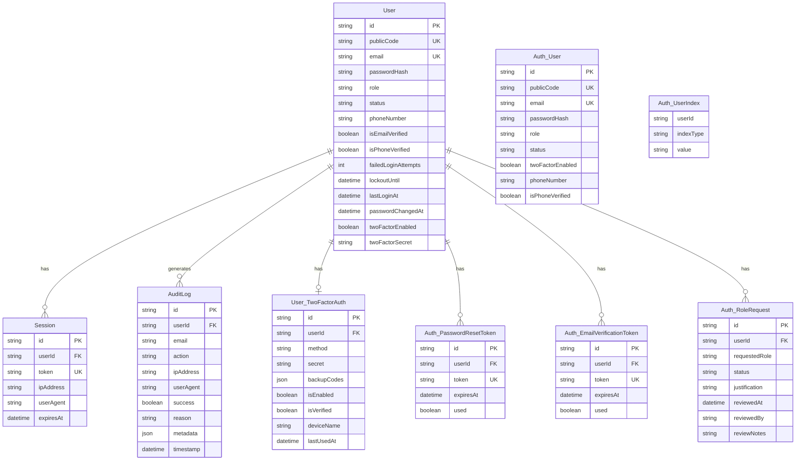
```mermaid
erDiagram
    User {
        string id PK
        string publicCode UK
        string email UK
        string passwordHash
        string role
        string status
        string phoneNumber
        boolean isEmailVerified
        boolean isPhoneVerified
        int failedLoginAttempts
        datetime lockoutUntil
        datetime lastLoginAt
        datetime passwordChangedAt
        boolean twoFactorEnabled
        string twoFactorSecret
    }

    Auth_User {
        string id PK
        string publicCode UK
        string email UK
        string passwordHash
        string role
        string status
        boolean twoFactorEnabled
        string phoneNumber
        boolean isPhoneVerified
    }

    Session {
        string id PK
        string userId FK
        string token UK
        string ipAddress
        string userAgent
        datetime expiresAt
    }

    User_TwoFactorAuth {
        string id PK
        string userId FK
        string method
        string secret
        json backupCodes
        boolean isEnabled
        boolean isVerified
        string deviceName
        datetime lastUsedAt
    }

    AuditLog {
        string id PK
        string userId FK
        string email
        string action
        string ipAddress
        string userAgent
        boolean success
        string reason
        json metadata
        datetime timestamp
    }

    Auth_PasswordResetToken {
        string id PK
        string userId FK
        string token UK
        datetime expiresAt
        boolean used
    }

    Auth_EmailVerificationToken {
        string id PK
        string userId FK
        string token UK
        datetime expiresAt
        boolean used
    }

    Auth_RoleRequest {
        string id PK
        string userId FK
        string requestedRole
        string status
        string justification
        datetime reviewedAt
        string reviewedBy
        string reviewNotes
    }

    Auth_UserIndex {
        string userId
        string indexType
        string value
    }

    User ||--o{ Session : "has"
    User ||--o{ AuditLog : "generates"
    User ||--o| User_TwoFactorAuth : "has"
    User ||--o{ Auth_PasswordResetToken : "has"
    User ||--o{ Auth_EmailVerificationToken : "has"
    User ||--o{ Auth_RoleRequest : "has"
```

---

## 2. User Service

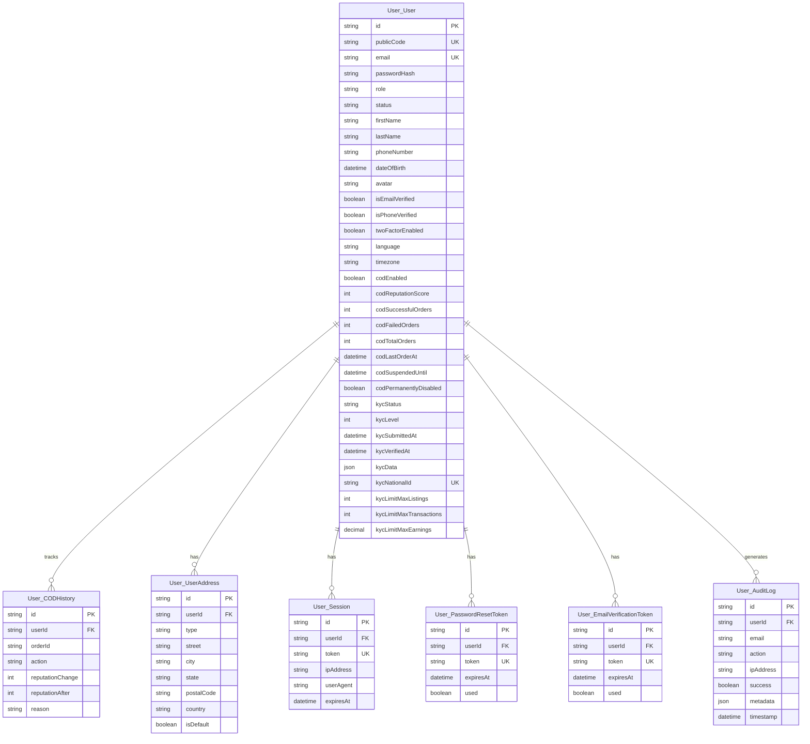
```mermaid
erDiagram
    User_User {
        string id PK
        string publicCode UK
        string email UK
        string passwordHash
        string role
        string status
        string firstName
        string lastName
        string phoneNumber
        datetime dateOfBirth
        string avatar
        boolean isEmailVerified
        boolean isPhoneVerified
        boolean twoFactorEnabled
        string language
        string timezone
        boolean codEnabled
        int codReputationScore
        int codSuccessfulOrders
        int codFailedOrders
        int codTotalOrders
        datetime codLastOrderAt
        datetime codSuspendedUntil
        boolean codPermanentlyDisabled
        string kycStatus
        int kycLevel
        datetime kycSubmittedAt
        datetime kycVerifiedAt
        json kycData
        string kycNationalId UK
        int kycLimitMaxListings
        int kycLimitMaxTransactions
        decimal kycLimitMaxEarnings
    }

    User_CODHistory {
        string id PK
        string userId FK
        string orderId
        string action
        int reputationChange
        int reputationAfter
        string reason
    }

    User_UserAddress {
        string id PK
        string userId FK
        string type
        string street
        string city
        string state
        string postalCode
        string country
        boolean isDefault
    }

    User_Session {
        string id PK
        string userId FK
        string token UK
        string ipAddress
        string userAgent
        datetime expiresAt
    }

    User_PasswordResetToken {
        string id PK
        string userId FK
        string token UK
        datetime expiresAt
        boolean used
    }

    User_EmailVerificationToken {
        string id PK
        string userId FK
        string token UK
        datetime expiresAt
        boolean used
    }

    User_AuditLog {
        string id PK
        string userId FK
        string email
        string action
        string ipAddress
        boolean success
        json metadata
        datetime timestamp
    }

    User_User ||--o{ User_CODHistory : "tracks"
    User_User ||--o{ User_UserAddress : "has"
    User_User ||--o{ User_Session : "has"
    User_User ||--o{ User_PasswordResetToken : "has"
    User_User ||--o{ User_EmailVerificationToken : "has"
    User_User ||--o{ User_AuditLog : "generates"
```

---

## 3. Business Registry

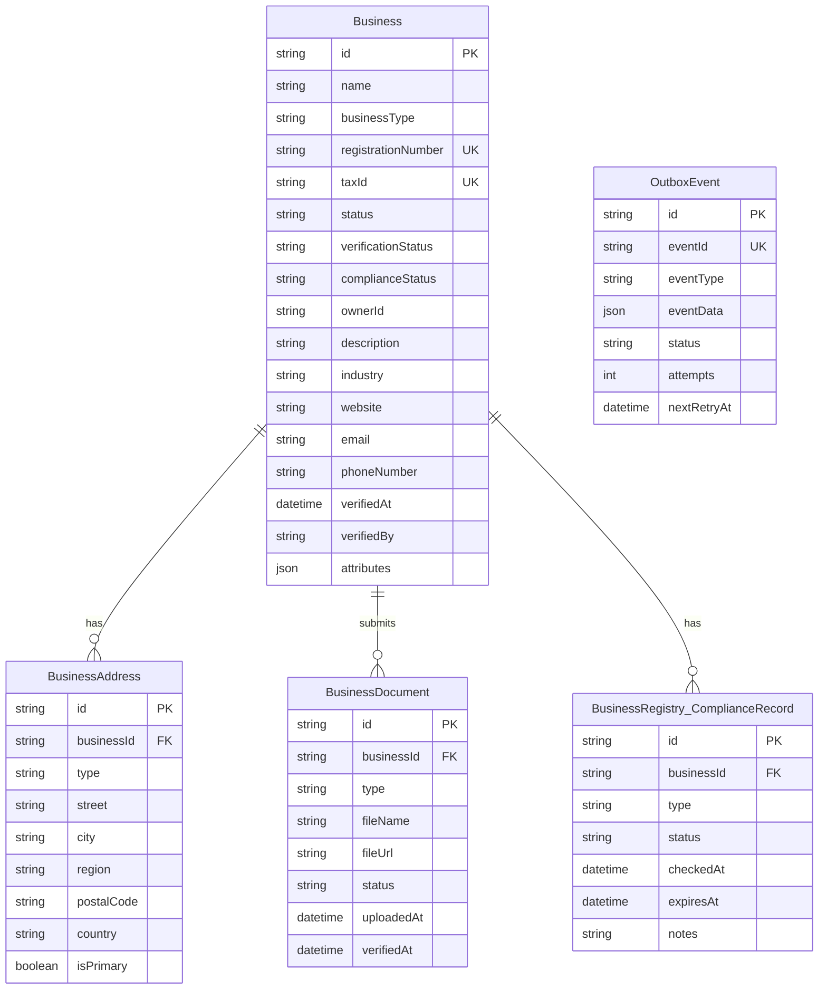
```mermaid
erDiagram
    Business {
        string id PK
        string name
        string businessType
        string registrationNumber UK
        string taxId UK
        string status
        string verificationStatus
        string complianceStatus
        string ownerId
        string description
        string industry
        string website
        string email
        string phoneNumber
        datetime verifiedAt
        string verifiedBy
        json attributes
    }

    BusinessAddress {
        string id PK
        string businessId FK
        string type
        string street
        string city
        string region
        string postalCode
        string country
        boolean isPrimary
    }

    BusinessDocument {
        string id PK
        string businessId FK
        string type
        string fileName
        string fileUrl
        string status
        datetime uploadedAt
        datetime verifiedAt
    }

    BusinessRegistry_ComplianceRecord {
        string id PK
        string businessId FK
        string type
        string status
        datetime checkedAt
        datetime expiresAt
        string notes
    }

    OutboxEvent {
        string id PK
        string eventId UK
        string eventType
        json eventData
        string status
        int attempts
        datetime nextRetryAt
    }

    Business ||--o{ BusinessAddress : "has"
    Business ||--o{ BusinessDocument : "submits"
    Business ||--o{ BusinessRegistry_ComplianceRecord : "has"
```

---

## 4. Catalog

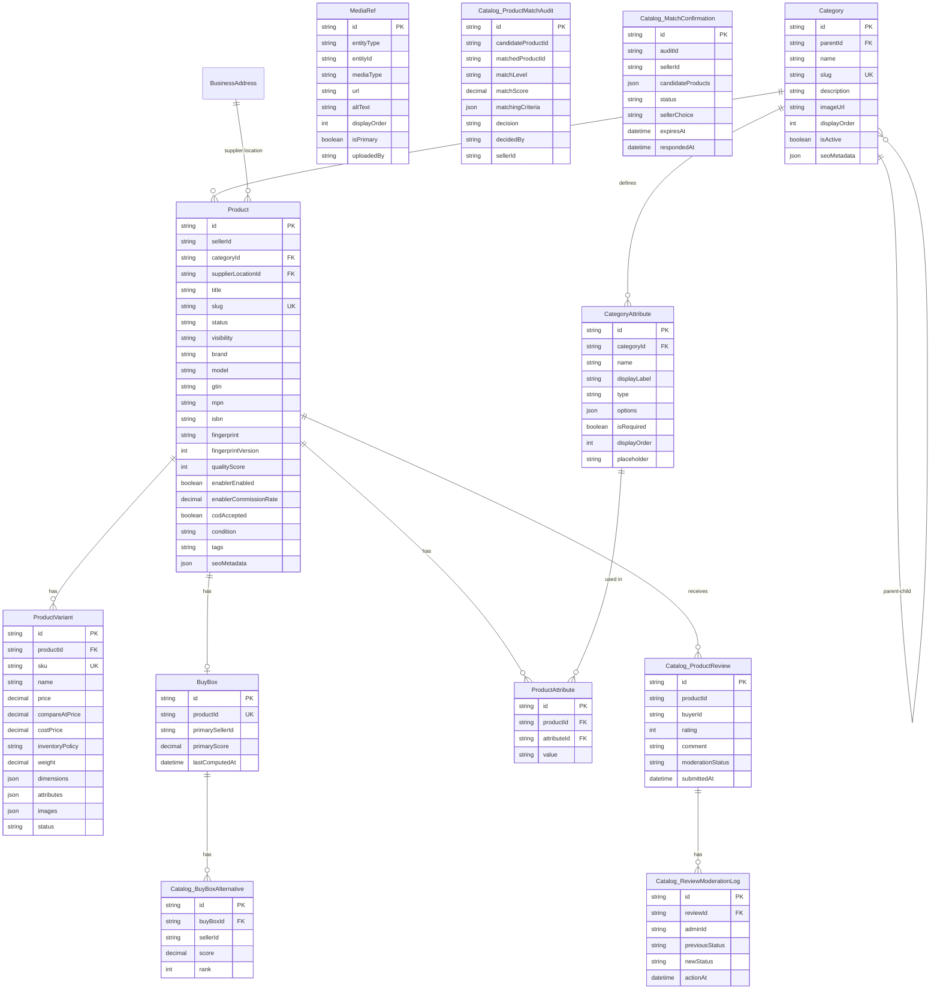
```mermaid
erDiagram
    Category {
        string id PK
        string parentId FK
        string name
        string slug UK
        string description
        string imageUrl
        int displayOrder
        boolean isActive
        json seoMetadata
    }

    Product {
        string id PK
        string sellerId
        string categoryId FK
        string supplierLocationId FK
        string title
        string slug UK
        string status
        string visibility
        string brand
        string model
        string gtin
        string mpn
        string isbn
        string fingerprint
        int fingerprintVersion
        int qualityScore
        boolean enablerEnabled
        decimal enablerCommissionRate
        boolean codAccepted
        string condition
        string tags
        json seoMetadata
    }

    ProductVariant {
        string id PK
        string productId FK
        string sku UK
        string name
        decimal price
        decimal compareAtPrice
        decimal costPrice
        string inventoryPolicy
        decimal weight
        json dimensions
        json attributes
        json images
        string status
    }

    BuyBox {
        string id PK
        string productId UK
        string primarySellerId
        decimal primaryScore
        datetime lastComputedAt
    }

    Catalog_BuyBoxAlternative {
        string id PK
        string buyBoxId FK
        string sellerId
        decimal score
        int rank
    }

    MediaRef {
        string id PK
        string entityType
        string entityId
        string mediaType
        string url
        string altText
        int displayOrder
        boolean isPrimary
        string uploadedBy
    }

    CategoryAttribute {
        string id PK
        string categoryId FK
        string name
        string displayLabel
        string type
        json options
        boolean isRequired
        int displayOrder
        string placeholder
    }

    ProductAttribute {
        string id PK
        string productId FK
        string attributeId FK
        string value
    }

    Catalog_ProductReview {
        string id PK
        string productId
        string buyerId
        int rating
        string comment
        string moderationStatus
        datetime submittedAt
    }

    Catalog_ReviewModerationLog {
        string id PK
        string reviewId FK
        string adminId
        string previousStatus
        string newStatus
        datetime actionAt
    }

    Catalog_ProductMatchAudit {
        string id PK
        string candidateProductId
        string matchedProductId
        string matchLevel
        decimal matchScore
        json matchingCriteria
        string decision
        string decidedBy
        string sellerId
    }

    Catalog_MatchConfirmation {
        string id PK
        string auditId
        string sellerId
        json candidateProducts
        string status
        string sellerChoice
        datetime expiresAt
        datetime respondedAt
    }

    Category ||--o{ Category : "parent-child"
    Category ||--o{ Product : "contains"
    Category ||--o{ CategoryAttribute : "defines"
    Product ||--o{ ProductVariant : "has"
    Product ||--o| BuyBox : "has"
    Product ||--o{ Catalog_ProductReview : "receives"
    Product ||--o{ ProductAttribute : "has"
    BuyBox ||--o{ Catalog_BuyBoxAlternative : "has"
    Catalog_ProductReview ||--o{ Catalog_ReviewModerationLog : "has"
    CategoryAttribute ||--o{ ProductAttribute : "used in"
    BusinessAddress ||--o{ Product : "supplier location"
```

---

## 5. Checkout

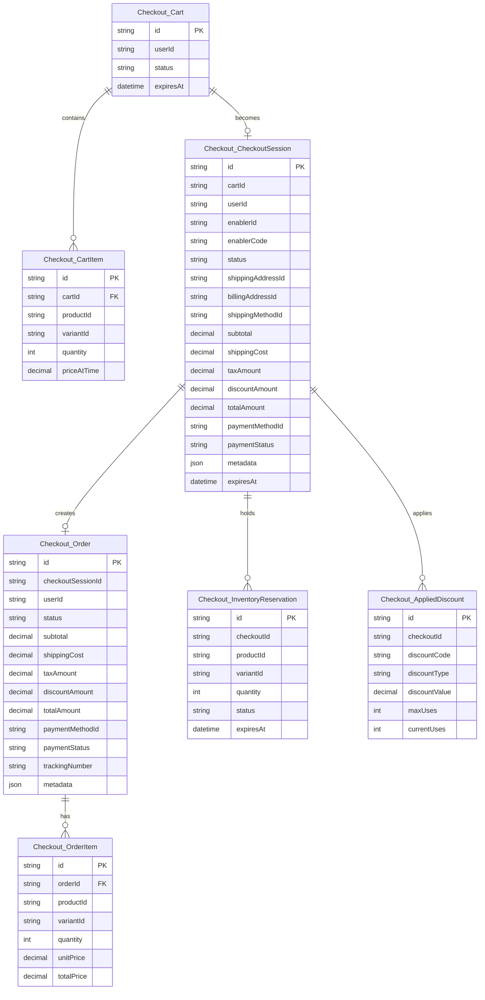
```mermaid
erDiagram
    Checkout_Cart {
        string id PK
        string userId
        string status
        datetime expiresAt
    }

    Checkout_CartItem {
        string id PK
        string cartId FK
        string productId
        string variantId
        int quantity
        decimal priceAtTime
    }

    Checkout_CheckoutSession {
        string id PK
        string cartId
        string userId
        string enablerId
        string enablerCode
        string status
        string shippingAddressId
        string billingAddressId
        string shippingMethodId
        decimal subtotal
        decimal shippingCost
        decimal taxAmount
        decimal discountAmount
        decimal totalAmount
        string paymentMethodId
        string paymentStatus
        json metadata
        datetime expiresAt
    }

    Checkout_Order {
        string id PK
        string checkoutSessionId
        string userId
        string status
        decimal subtotal
        decimal shippingCost
        decimal taxAmount
        decimal discountAmount
        decimal totalAmount
        string paymentMethodId
        string paymentStatus
        string trackingNumber
        json metadata
    }

    Checkout_OrderItem {
        string id PK
        string orderId FK
        string productId
        string variantId
        int quantity
        decimal unitPrice
        decimal totalPrice
    }

    Checkout_InventoryReservation {
        string id PK
        string checkoutId
        string productId
        string variantId
        int quantity
        string status
        datetime expiresAt
    }

    Checkout_AppliedDiscount {
        string id PK
        string checkoutId
        string discountCode
        string discountType
        decimal discountValue
        int maxUses
        int currentUses
    }

    Checkout_Cart ||--o{ Checkout_CartItem : "contains"
    Checkout_Cart ||--o| Checkout_CheckoutSession : "becomes"
    Checkout_CheckoutSession ||--o| Checkout_Order : "creates"
    Checkout_Order ||--o{ Checkout_OrderItem : "has"
    Checkout_CheckoutSession ||--o{ Checkout_InventoryReservation : "holds"
    Checkout_CheckoutSession ||--o{ Checkout_AppliedDiscount : "applies"
```

---

## 6. Order Service

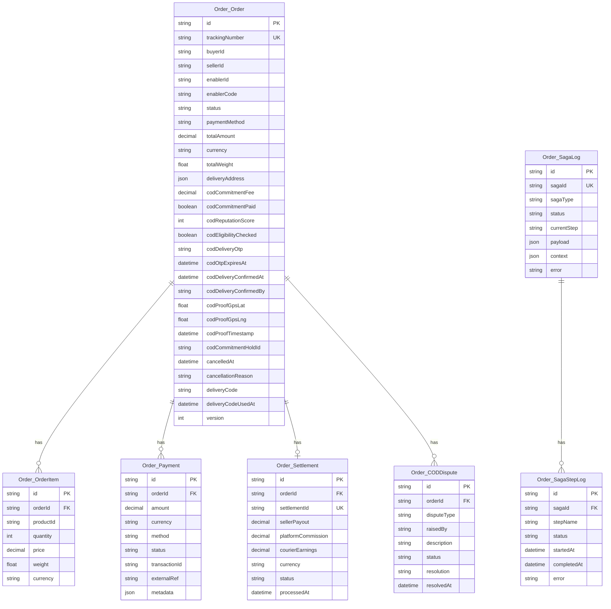
```mermaid
erDiagram
    Order_Order {
        string id PK
        string trackingNumber UK
        string buyerId
        string sellerId
        string enablerId
        string enablerCode
        string status
        string paymentMethod
        decimal totalAmount
        string currency
        float totalWeight
        json deliveryAddress
        decimal codCommitmentFee
        boolean codCommitmentPaid
        int codReputationScore
        boolean codEligibilityChecked
        string codDeliveryOtp
        datetime codOtpExpiresAt
        datetime codDeliveryConfirmedAt
        string codDeliveryConfirmedBy
        float codProofGpsLat
        float codProofGpsLng
        datetime codProofTimestamp
        string codCommitmentHoldId
        datetime cancelledAt
        string cancellationReason
        string deliveryCode
        datetime deliveryCodeUsedAt
        int version
    }

    Order_OrderItem {
        string id PK
        string orderId FK
        string productId
        int quantity
        decimal price
        float weight
        string currency
    }

    Order_Payment {
        string id PK
        string orderId FK
        decimal amount
        string currency
        string method
        string status
        string transactionId
        string externalRef
        json metadata
    }

    Order_Settlement {
        string id PK
        string orderId FK
        string settlementId UK
        decimal sellerPayout
        decimal platformCommission
        decimal courierEarnings
        string currency
        string status
        datetime processedAt
    }

    Order_CODDispute {
        string id PK
        string orderId FK
        string disputeType
        string raisedBy
        string description
        string status
        string resolution
        datetime resolvedAt
    }

    Order_SagaLog {
        string id PK
        string sagaId UK
        string sagaType
        string status
        string currentStep
        json payload
        json context
        string error
    }

    Order_SagaStepLog {
        string id PK
        string sagaId FK
        string stepName
        string status
        datetime startedAt
        datetime completedAt
        string error
    }

    Order_Order ||--o{ Order_OrderItem : "has"
    Order_Order ||--o{ Order_Payment : "has"
    Order_Order ||--o| Order_Settlement : "has"
    Order_Order ||--o{ Order_CODDispute : "has"
    Order_SagaLog ||--o{ Order_SagaStepLog : "has"
```

---

## 7. Payment Service

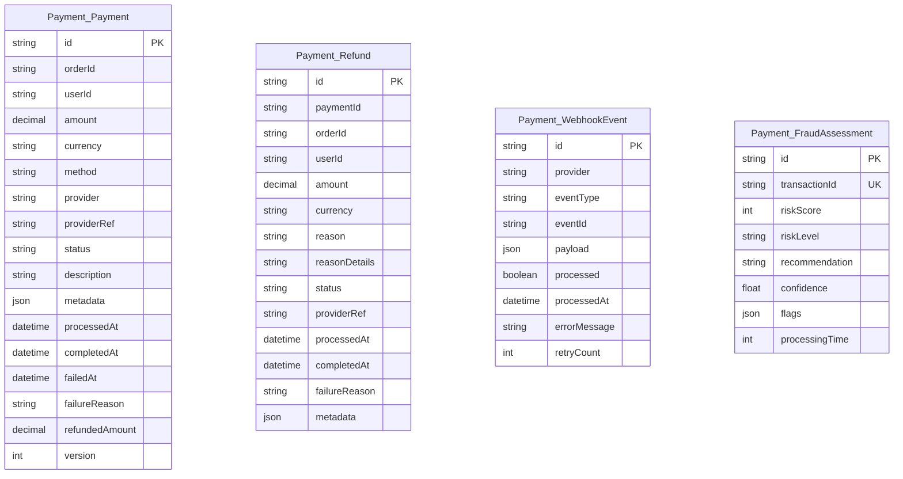
```mermaid
erDiagram
    Payment_Payment {
        string id PK
        string orderId
        string userId
        decimal amount
        string currency
        string method
        string provider
        string providerRef
        string status
        string description
        json metadata
        datetime processedAt
        datetime completedAt
        datetime failedAt
        string failureReason
        decimal refundedAmount
        int version
    }

    Payment_Refund {
        string id PK
        string paymentId
        string orderId
        string userId
        decimal amount
        string currency
        string reason
        string reasonDetails
        string status
        string providerRef
        datetime processedAt
        datetime completedAt
        string failureReason
        json metadata
    }

    Payment_WebhookEvent {
        string id PK
        string provider
        string eventType
        string eventId
        json payload
        boolean processed
        datetime processedAt
        string errorMessage
        int retryCount
    }

    Payment_FraudAssessment {
        string id PK
        string transactionId UK
        int riskScore
        string riskLevel
        string recommendation
        float confidence
        json flags
        int processingTime
    }
```

---

## 8. Wallet Service

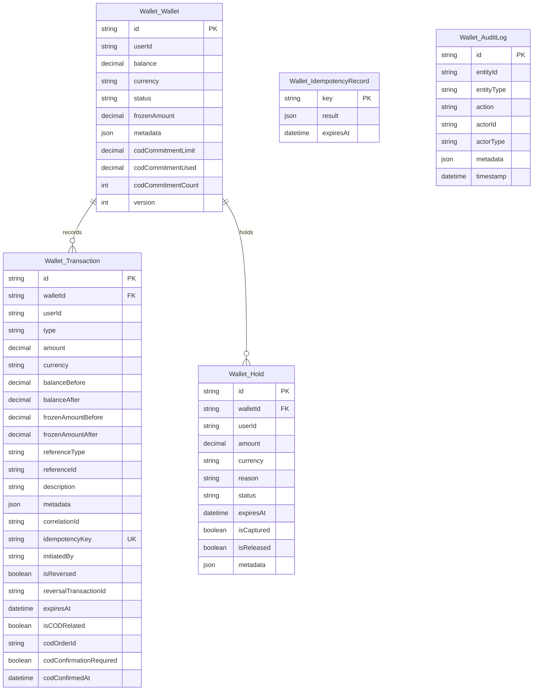
```mermaid
erDiagram
    Wallet_Wallet {
        string id PK
        string userId
        decimal balance
        string currency
        string status
        decimal frozenAmount
        json metadata
        decimal codCommitmentLimit
        decimal codCommitmentUsed
        int codCommitmentCount
        int version
    }

    Wallet_Transaction {
        string id PK
        string walletId FK
        string userId
        string type
        decimal amount
        string currency
        decimal balanceBefore
        decimal balanceAfter
        decimal frozenAmountBefore
        decimal frozenAmountAfter
        string referenceType
        string referenceId
        string description
        json metadata
        string correlationId
        string idempotencyKey UK
        string initiatedBy
        boolean isReversed
        string reversalTransactionId
        datetime expiresAt
        boolean isCODRelated
        string codOrderId
        boolean codConfirmationRequired
        datetime codConfirmedAt
    }

    Wallet_Hold {
        string id PK
        string walletId FK
        string userId
        decimal amount
        string currency
        string reason
        string status
        datetime expiresAt
        boolean isCaptured
        boolean isReleased
        json metadata
    }

    Wallet_IdempotencyRecord {
        string key PK
        json result
        datetime expiresAt
    }

    Wallet_AuditLog {
        string id PK
        string entityId
        string entityType
        string action
        string actorId
        string actorType
        json metadata
        datetime timestamp
    }

    Wallet_Wallet ||--o{ Wallet_Transaction : "records"
    Wallet_Wallet ||--o{ Wallet_Hold : "holds"
```

---

## 9. Payout Service

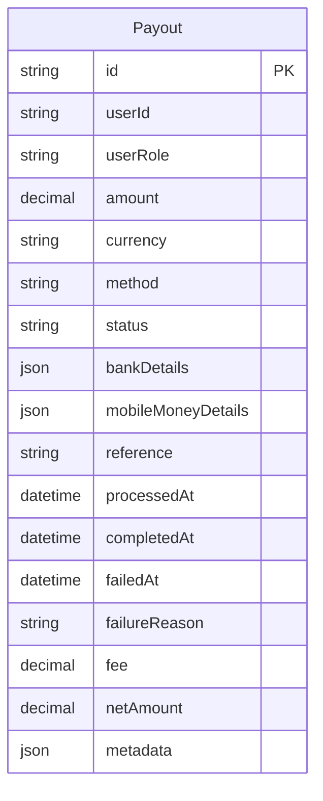
```mermaid
erDiagram
    Payout {
        string id PK
        string userId
        string userRole
        decimal amount
        string currency
        string method
        string status
        json bankDetails
        json mobileMoneyDetails
        string reference
        datetime processedAt
        datetime completedAt
        datetime failedAt
        string failureReason
        decimal fee
        decimal netAmount
        json metadata
    }
```

---

## 10. Commission Service

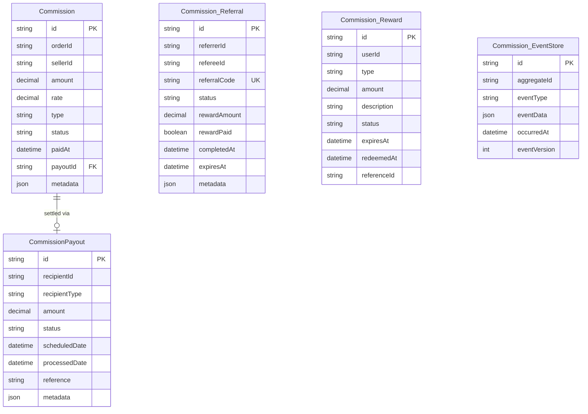
```mermaid
erDiagram
    Commission {
        string id PK
        string orderId
        string sellerId
        decimal amount
        decimal rate
        string type
        string status
        datetime paidAt
        string payoutId FK
        json metadata
    }

    CommissionPayout {
        string id PK
        string recipientId
        string recipientType
        decimal amount
        string status
        datetime scheduledDate
        datetime processedDate
        string reference
        json metadata
    }

    Commission_Referral {
        string id PK
        string referrerId
        string refereeId
        string referralCode UK
        string status
        decimal rewardAmount
        boolean rewardPaid
        datetime completedAt
        datetime expiresAt
        json metadata
    }

    Commission_Reward {
        string id PK
        string userId
        string type
        decimal amount
        string description
        string status
        datetime expiresAt
        datetime redeemedAt
        string referenceId
    }

    Commission_EventStore {
        string id PK
        string aggregateId
        string eventType
        json eventData
        datetime occurredAt
        int eventVersion
    }

    Commission ||--o| CommissionPayout : "settled via"
```

---

## 11. Inventory Service

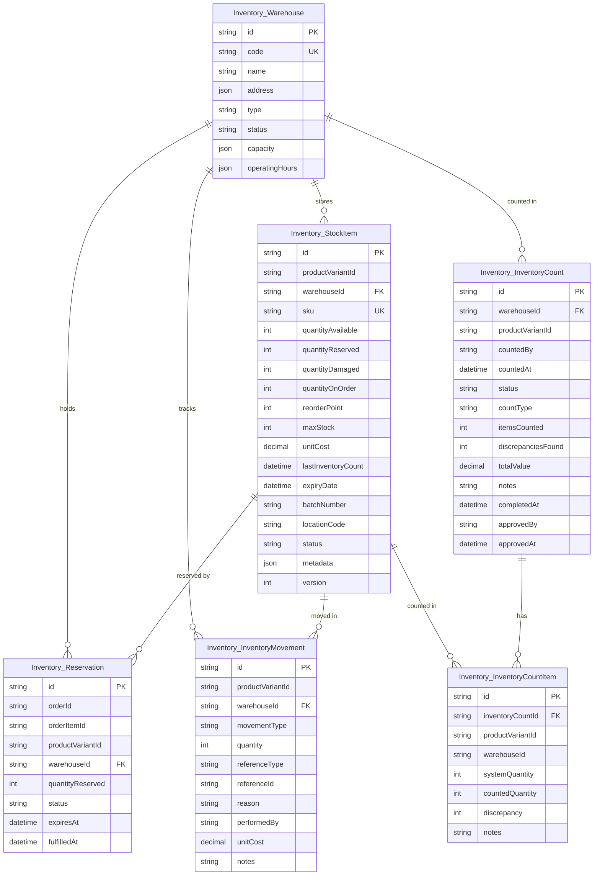
```mermaid
erDiagram
    Inventory_Warehouse {
        string id PK
        string code UK
        string name
        json address
        string type
        string status
        json capacity
        json operatingHours
    }

    Inventory_StockItem {
        string id PK
        string productVariantId
        string warehouseId FK
        string sku UK
        int quantityAvailable
        int quantityReserved
        int quantityDamaged
        int quantityOnOrder
        int reorderPoint
        int maxStock
        decimal unitCost
        datetime lastInventoryCount
        datetime expiryDate
        string batchNumber
        string locationCode
        string status
        json metadata
        int version
    }

    Inventory_Reservation {
        string id PK
        string orderId
        string orderItemId
        string productVariantId
        string warehouseId FK
        int quantityReserved
        string status
        datetime expiresAt
        datetime fulfilledAt
    }

    Inventory_InventoryMovement {
        string id PK
        string productVariantId
        string warehouseId FK
        string movementType
        int quantity
        string referenceType
        string referenceId
        string reason
        string performedBy
        decimal unitCost
        string notes
    }

    Inventory_InventoryCount {
        string id PK
        string warehouseId FK
        string productVariantId
        string countedBy
        datetime countedAt
        string status
        string countType
        int itemsCounted
        int discrepanciesFound
        decimal totalValue
        string notes
        datetime completedAt
        string approvedBy
        datetime approvedAt
    }

    Inventory_InventoryCountItem {
        string id PK
        string inventoryCountId FK
        string productVariantId
        string warehouseId
        int systemQuantity
        int countedQuantity
        int discrepancy
        string notes
    }

    Inventory_Warehouse ||--o{ Inventory_StockItem : "stores"
    Inventory_Warehouse ||--o{ Inventory_Reservation : "holds"
    Inventory_Warehouse ||--o{ Inventory_InventoryMovement : "tracks"
    Inventory_Warehouse ||--o{ Inventory_InventoryCount : "counted in"
    Inventory_StockItem ||--o{ Inventory_Reservation : "reserved by"
    Inventory_StockItem ||--o{ Inventory_InventoryMovement : "moved in"
    Inventory_StockItem ||--o{ Inventory_InventoryCountItem : "counted in"
    Inventory_InventoryCount ||--o{ Inventory_InventoryCountItem : "has"
```

---

## 12. Logistics Service

> The `Logistics_*` models below are the **legacy** courier/delivery surface. The optimization-engine rollout (Phases 1–6) added the following models — full field lists in `prisma/schema.prisma`, and an as-built model map in [`docs/logistics/LOGISTICS_IMPLEMENTATION.md`](../logistics/LOGISTICS_IMPLEMENTATION.md) §2:
> `Logistics_Quote`, `Logistics_PricingConfig`, `Logistics_PricingAuditRecord`, `Logistics_DeliveryGroup`, `Logistics_ConsolidationAudit`, `Logistics_Shipment`, `Logistics_DeliveryJob`, `Logistics_Vehicle`, `Logistics_VehicleTariff`, `Logistics_CostAdjustment`, `Logistics_LedgerEntry`, `Logistics_FulfillmentCommitment`, `Logistics_OptimizationConfig`, `Logistics_FairnessFlag`, `Logistics_BuyerProfile`, `Logistics_DriverMatchAudit`, `Logistics_RouteInsertionCandidate`, `Logistics_ShipmentPoolEntry`, `Logistics_PoolOptimizationRun`.

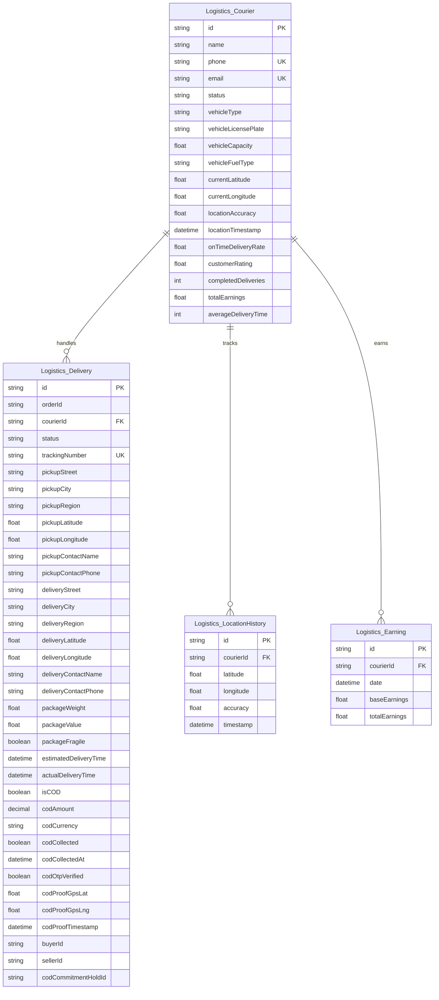
```mermaid
erDiagram
    Logistics_Courier {
        string id PK
        string name
        string phone UK
        string email UK
        string status
        string vehicleType
        string vehicleLicensePlate
        float vehicleCapacity
        string vehicleFuelType
        float currentLatitude
        float currentLongitude
        float locationAccuracy
        datetime locationTimestamp
        float onTimeDeliveryRate
        float customerRating
        int completedDeliveries
        float totalEarnings
        int averageDeliveryTime
    }

    Logistics_Delivery {
        string id PK
        string orderId
        string courierId FK
        string status
        string trackingNumber UK
        string pickupStreet
        string pickupCity
        string pickupRegion
        float pickupLatitude
        float pickupLongitude
        string pickupContactName
        string pickupContactPhone
        string deliveryStreet
        string deliveryCity
        string deliveryRegion
        float deliveryLatitude
        float deliveryLongitude
        string deliveryContactName
        string deliveryContactPhone
        float packageWeight
        float packageValue
        boolean packageFragile
        datetime estimatedDeliveryTime
        datetime actualDeliveryTime
        boolean isCOD
        decimal codAmount
        string codCurrency
        boolean codCollected
        datetime codCollectedAt
        boolean codOtpVerified
        float codProofGpsLat
        float codProofGpsLng
        datetime codProofTimestamp
        string buyerId
        string sellerId
        string codCommitmentHoldId
    }

    Logistics_LocationHistory {
        string id PK
        string courierId FK
        float latitude
        float longitude
        float accuracy
        datetime timestamp
    }

    Logistics_Earning {
        string id PK
        string courierId FK
        datetime date
        float baseEarnings
        float totalEarnings
    }

    Logistics_Courier ||--o{ Logistics_Delivery : "handles"
    Logistics_Courier ||--o{ Logistics_LocationHistory : "tracks"
    Logistics_Courier ||--o{ Logistics_Earning : "earns"
```

---

## 13. Notification Service

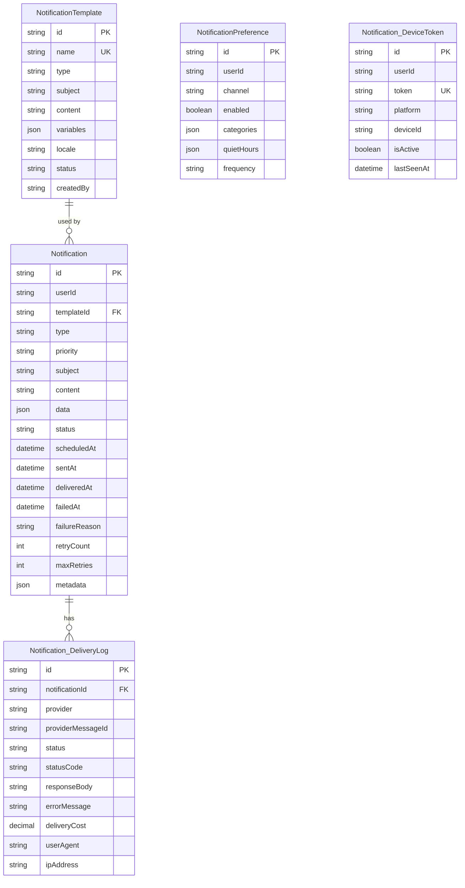
```mermaid
erDiagram
    NotificationTemplate {
        string id PK
        string name UK
        string type
        string subject
        string content
        json variables
        string locale
        string status
        string createdBy
    }

    Notification {
        string id PK
        string userId
        string templateId FK
        string type
        string priority
        string subject
        string content
        json data
        string status
        datetime scheduledAt
        datetime sentAt
        datetime deliveredAt
        datetime failedAt
        string failureReason
        int retryCount
        int maxRetries
        json metadata
    }

    Notification_DeliveryLog {
        string id PK
        string notificationId FK
        string provider
        string providerMessageId
        string status
        string statusCode
        string responseBody
        string errorMessage
        decimal deliveryCost
        string userAgent
        string ipAddress
    }

    NotificationPreference {
        string id PK
        string userId
        string channel
        boolean enabled
        json categories
        json quietHours
        string frequency
    }

    Notification_DeviceToken {
        string id PK
        string userId
        string token UK
        string platform
        string deviceId
        boolean isActive
        datetime lastSeenAt
    }

    NotificationTemplate ||--o{ Notification : "used by"
    Notification ||--o{ Notification_DeliveryLog : "has"
```

---

## 14. Enabler Service

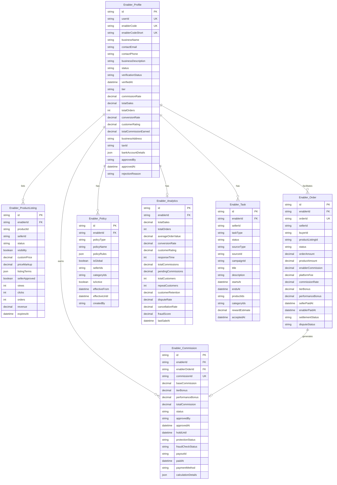
```mermaid
erDiagram
    Enabler_Profile {
        string id PK
        string userId UK
        string enablerCode UK
        string enablerCodeShort UK
        string businessName
        string contactEmail
        string contactPhone
        string businessDescription
        string status
        string verificationStatus
        datetime verifiedAt
        string tier
        decimal commissionRate
        decimal totalSales
        int totalOrders
        decimal conversionRate
        decimal customerRating
        decimal totalCommissionEarned
        string businessAddress
        string taxId
        json bankAccountDetails
        string approvedBy
        datetime approvedAt
        string rejectionReason
    }

    Enabler_ProductListing {
        string id PK
        string enablerId FK
        string productId
        string sellerId
        string status
        boolean visibility
        decimal customPrice
        decimal priceMarkup
        json listingTerms
        boolean sellerApproved
        int views
        int clicks
        int orders
        decimal revenue
        datetime expiresAt
    }

    Enabler_Order {
        string id PK
        string enablerId FK
        string orderId UK
        string sellerId
        string buyerId
        string productListingId
        string status
        decimal orderAmount
        decimal productAmount
        decimal enablerCommission
        decimal platformFee
        decimal commissionRate
        decimal tierBonus
        decimal performanceBonus
        datetime sellerPaidAt
        datetime enablerPaidAt
        string settlementStatus
        string disputeStatus
    }

    Enabler_Commission {
        string id PK
        string enablerId FK
        string enablerOrderId FK
        string commissionId UK
        decimal baseCommission
        decimal tierBonus
        decimal performanceBonus
        decimal totalCommission
        string status
        string approvedBy
        datetime approvedAt
        datetime holdUntil
        string protectionStatus
        string fraudCheckStatus
        string payoutId
        datetime paidAt
        string paymentMethod
        json calculationDetails
    }

    Enabler_Policy {
        string id PK
        string enablerId FK
        string policyType
        string policyName
        json policyRules
        boolean isGlobal
        string sellerIds
        string categoryIds
        boolean isActive
        datetime effectiveFrom
        datetime effectiveUntil
        string createdBy
    }

    Enabler_Analytics {
        string id PK
        string enablerId FK
        decimal totalSales
        int totalOrders
        decimal averageOrderValue
        decimal conversionRate
        decimal customerRating
        int responseTime
        decimal totalCommissions
        decimal pendingCommissions
        int totalCustomers
        int repeatCustomers
        decimal customerRetention
        decimal disputeRate
        decimal cancellationRate
        decimal fraudScore
        datetime lastSaleAt
    }

    Enabler_Task {
        string id PK
        string enablerId FK
        string sellerId
        string taskType
        string status
        string sourceType
        string sourceId
        string campaignId
        string title
        string description
        datetime startsAt
        datetime endsAt
        string productIds
        string categoryIds
        decimal rewardEstimate
        datetime acceptedAt
    }

    Enabler_Profile ||--o{ Enabler_ProductListing : "lists"
    Enabler_Profile ||--o{ Enabler_Order : "facilitates"
    Enabler_Profile ||--o{ Enabler_Commission : "earns"
    Enabler_Profile ||--o{ Enabler_Policy : "has"
    Enabler_Profile ||--o| Enabler_Analytics : "has"
    Enabler_Profile ||--o{ Enabler_Task : "has"
    Enabler_Order ||--o| Enabler_Commission : "generates"
```

---

## 15. Campaign Service

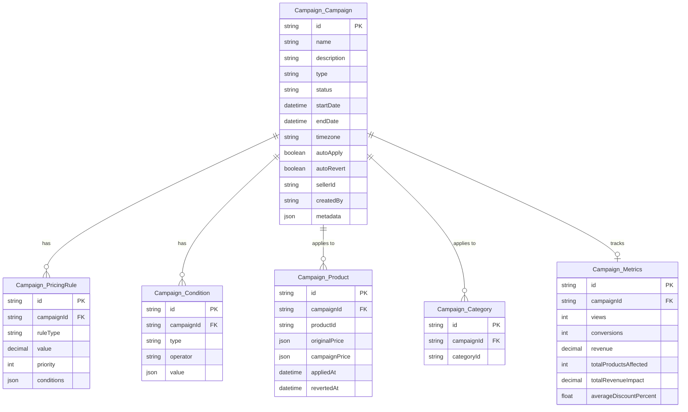
```mermaid
erDiagram
    Campaign_Campaign {
        string id PK
        string name
        string description
        string type
        string status
        datetime startDate
        datetime endDate
        string timezone
        boolean autoApply
        boolean autoRevert
        string sellerId
        string createdBy
        json metadata
    }

    Campaign_PricingRule {
        string id PK
        string campaignId FK
        string ruleType
        decimal value
        int priority
        json conditions
    }

    Campaign_Condition {
        string id PK
        string campaignId FK
        string type
        string operator
        json value
    }

    Campaign_Product {
        string id PK
        string campaignId FK
        string productId
        json originalPrice
        json campaignPrice
        datetime appliedAt
        datetime revertedAt
    }

    Campaign_Category {
        string id PK
        string campaignId FK
        string categoryId
    }

    Campaign_Metrics {
        string id PK
        string campaignId FK
        int views
        int conversions
        decimal revenue
        int totalProductsAffected
        decimal totalRevenueImpact
        float averageDiscountPercent
    }

    Campaign_Campaign ||--o{ Campaign_PricingRule : "has"
    Campaign_Campaign ||--o{ Campaign_Condition : "has"
    Campaign_Campaign ||--o{ Campaign_Product : "applies to"
    Campaign_Campaign ||--o{ Campaign_Category : "applies to"
    Campaign_Campaign ||--o| Campaign_Metrics : "tracks"
```

---

## 16. Training Service

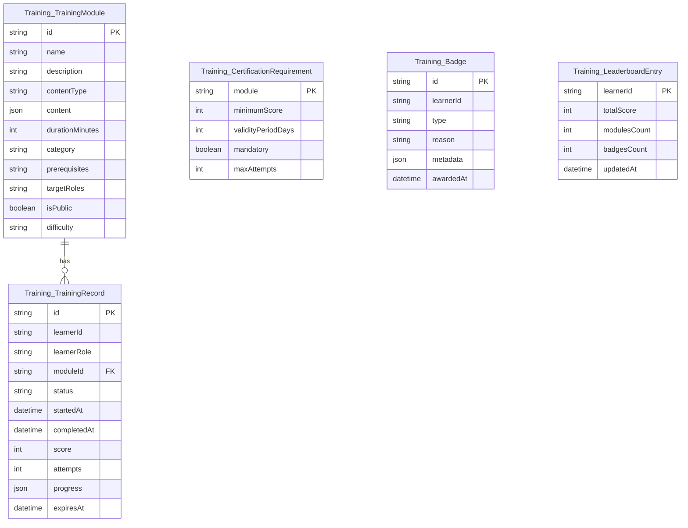
```mermaid
erDiagram
    Training_TrainingModule {
        string id PK
        string name
        string description
        string contentType
        json content
        int durationMinutes
        string category
        string prerequisites
        string targetRoles
        boolean isPublic
        string difficulty
    }

    Training_TrainingRecord {
        string id PK
        string learnerId
        string learnerRole
        string moduleId FK
        string status
        datetime startedAt
        datetime completedAt
        int score
        int attempts
        json progress
        datetime expiresAt
    }

    Training_CertificationRequirement {
        string module PK
        int minimumScore
        int validityPeriodDays
        boolean mandatory
        int maxAttempts
    }

    Training_Badge {
        string id PK
        string learnerId
        string type
        string reason
        json metadata
        datetime awardedAt
    }

    Training_LeaderboardEntry {
        string learnerId PK
        int totalScore
        int modulesCount
        int badgesCount
        datetime updatedAt
    }

    Training_TrainingModule ||--o{ Training_TrainingRecord : "has"
```

---

## 17. Support Service

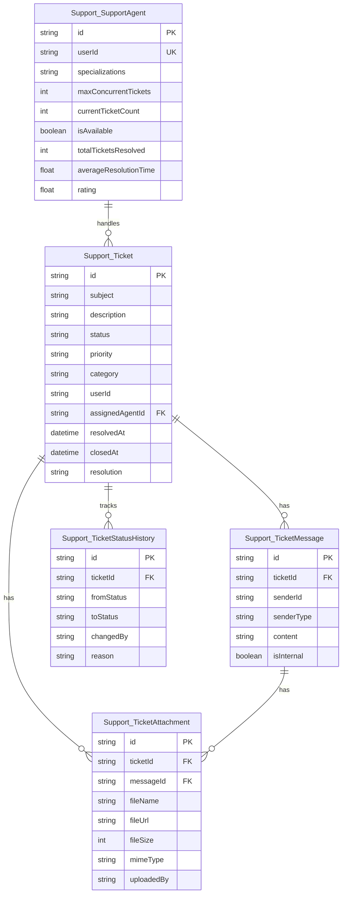
```mermaid
erDiagram
    Support_SupportAgent {
        string id PK
        string userId UK
        string specializations
        int maxConcurrentTickets
        int currentTicketCount
        boolean isAvailable
        int totalTicketsResolved
        float averageResolutionTime
        float rating
    }

    Support_Ticket {
        string id PK
        string subject
        string description
        string status
        string priority
        string category
        string userId
        string assignedAgentId FK
        datetime resolvedAt
        datetime closedAt
        string resolution
    }

    Support_TicketMessage {
        string id PK
        string ticketId FK
        string senderId
        string senderType
        string content
        boolean isInternal
    }

    Support_TicketAttachment {
        string id PK
        string ticketId FK
        string messageId FK
        string fileName
        string fileUrl
        int fileSize
        string mimeType
        string uploadedBy
    }

    Support_TicketStatusHistory {
        string id PK
        string ticketId FK
        string fromStatus
        string toStatus
        string changedBy
        string reason
    }

    Support_SupportAgent ||--o{ Support_Ticket : "handles"
    Support_Ticket ||--o{ Support_TicketMessage : "has"
    Support_Ticket ||--o{ Support_TicketAttachment : "has"
    Support_Ticket ||--o{ Support_TicketStatusHistory : "tracks"
    Support_TicketMessage ||--o{ Support_TicketAttachment : "has"
```

---

## 18. Community Service

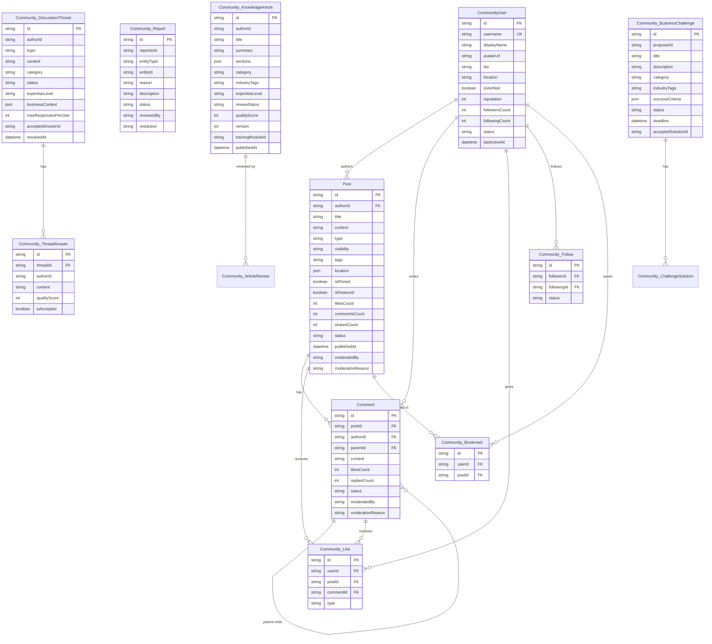
```mermaid
erDiagram
    CommunityUser {
        string id PK
        string username UK
        string displayName
        string avatarUrl
        string bio
        string location
        boolean isVerified
        int reputation
        int followersCount
        int followingCount
        string status
        datetime lastActiveAt
    }

    Post {
        string id PK
        string authorId FK
        string title
        string content
        string type
        string visibility
        string tags
        json location
        boolean isPinned
        boolean isFeatured
        int likesCount
        int commentsCount
        int sharesCount
        string status
        datetime publishedAt
        string moderatedBy
        string moderationReason
    }

    Comment {
        string id PK
        string postId FK
        string authorId FK
        string parentId FK
        string content
        int likesCount
        int repliesCount
        string status
        string moderatedBy
        string moderationReason
    }

    Community_Like {
        string id PK
        string userId FK
        string postId FK
        string commentId FK
        string type
    }

    Community_Follow {
        string id PK
        string followerId FK
        string followingId FK
        string status
    }

    Community_Bookmark {
        string id PK
        string userId FK
        string postId FK
    }

    Community_Report {
        string id PK
        string reporterId
        string entityType
        string entityId
        string reason
        string description
        string status
        string reviewedBy
        string resolution
    }

    Community_DiscussionThread {
        string id PK
        string authorId
        string topic
        string content
        string category
        string status
        string expertiseLevel
        json businessContext
        int maxResponsesPerUser
        string acceptedAnswerId
        datetime resolvedAt
    }

    Community_ThreadAnswer {
        string id PK
        string threadId FK
        string authorId
        string content
        int qualityScore
        boolean isAccepted
    }

    Community_KnowledgeArticle {
        string id PK
        string authorId
        string title
        string summary
        json sections
        string category
        string industryTags
        string expertiseLevel
        string reviewStatus
        int qualityScore
        int version
        string trainingModuleId
        datetime publishedAt
    }

    Community_BusinessChallenge {
        string id PK
        string proposerId
        string title
        string description
        string category
        string industryTags
        json successCriteria
        string status
        datetime deadline
        string acceptedSolutionId
    }

    CommunityUser ||--o{ Post : "authors"
    CommunityUser ||--o{ Comment : "writes"
    CommunityUser ||--o{ Community_Like : "gives"
    CommunityUser ||--o{ Community_Follow : "follows"
    CommunityUser ||--o{ Community_Bookmark : "saves"
    Post ||--o{ Comment : "has"
    Post ||--o{ Community_Like : "receives"
    Post ||--o{ Community_Bookmark : "saved in"
    Comment ||--o{ Comment : "parent-child"
    Comment ||--o{ Community_Like : "receives"
    Community_DiscussionThread ||--o{ Community_ThreadAnswer : "has"
    Community_KnowledgeArticle ||--o{ Community_ArticleReview : "reviewed by"
    Community_BusinessChallenge ||--o{ Community_ChallengeSolution : "has"
```

---

## 19. Compliance Service

```mermaid
erDiagram
    Compliance_KYCRecord {
        string id PK
        string userId
        string verificationStatus
        datetime submittedAt
        datetime verifiedAt
        string verifiedBy
        json documents
        string rejectionReason
        datetime expiryDate
        string riskLevel
    }

    Compliance_AMLRecord {
        string id PK
        string userId UK
        string sanctionsStatus
        boolean pepStatus
        float riskScore
        datetime lastCheckAt
        json flags
    }

    Compliance_TRARecord {
        string id PK
        string userId
        string tin UK
        string vrn
        string taxComplianceStatus
        datetime lastFiscalCheck
        string efdStatus
    }

    Compliance_TCRARecord {
        string id PK
        string userId
        string licenseNumber
        string status
        datetime registrationAt
        datetime expiryDate
        datetime lastAuditAt
        json auditFindings
    }

    Compliance_MarketRecord {
        string id PK
        string sellerId
        float ethicalScore
        string qualityStatus
        json certifications
        datetime lastAuditAt
    }

    Compliance_SubjectRightsRequest {
        string id PK
        string userId
        string requestType
        string status
        datetime requestedAt
        datetime completedAt
        json data
        string reason
    }

    Compliance_ComplianceAuditLog {
        string id PK
        string action
        string resource
        string userId
        datetime timestamp
        string ipAddress
        string userAgent
        json details
    }

    Compliance_DataRetentionPolicy {
        string id PK
        string dataType
        int retentionPeriod
        string legalBasis
        string applicableLaw
        boolean autoDelete
        datetime lastReviewed
        datetime nextReviewDate
    }

    Compliance_DataDeletionLog {
        string id PK
        string userId
        string dataType
        int recordsDeleted
        datetime deletedAt
        string requestedBy
        string reason
    }

    Compliance_DataProcessingRecord {
        string id PK
        string purpose
        json categories
        json recipients
        string retentionPeriod
        json securityMeasures
        datetime lastReviewed
    }

    Compliance_PrivacyImpactAssessment {
        string id PK
        string projectName
        datetime assessmentDate
        string assessor
        string riskLevel
        json findings
        json recommendations
        string status
    }

    Kyc_AuditLog {
        string id PK
        string userId
        string action
        int previousLevel
        int newLevel
        string previousStatus
        string newStatus
        string performedBy
        string reason
        json metadata
        datetime timestamp
    }
```

---

## 20. Analytics Service

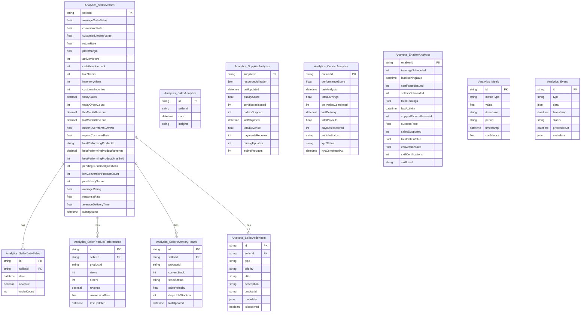
```mermaid
erDiagram
    Analytics_SellerMetrics {
        string sellerId PK
        float averageOrderValue
        float conversionRate
        float customerLifetimeValue
        float returnRate
        float profitMargin
        int activeVisitors
        int cartAbandonment
        int liveOrders
        int inventoryAlerts
        int customerInquiries
        decimal todaySales
        int todayOrderCount
        decimal thisMonthRevenue
        decimal lastMonthRevenue
        float monthOverMonthGrowth
        float repeatCustomerRate
        string bestPerformingProductId
        decimal bestPerformingProductRevenue
        int bestPerformingProductUnitsSold
        int pendingCustomerQuestions
        int lowConversionProductCount
        int profitabilityScore
        float averageRating
        float responseRate
        float averageDeliveryTime
        datetime lastUpdated
    }

    Analytics_SellerDailySales {
        string id PK
        string sellerId FK
        datetime date
        decimal revenue
        int orderCount
    }

    Analytics_SellerProductPerformance {
        string id PK
        string sellerId FK
        string productId
        int views
        int orders
        decimal revenue
        float conversionRate
        datetime lastUpdated
    }

    Analytics_SellerInventoryHealth {
        string id PK
        string sellerId FK
        string productId
        int currentStock
        string stockStatus
        float salesVelocity
        int daysUntilStockout
        datetime lastUpdated
    }

    Analytics_SellerActionItem {
        string id PK
        string sellerId FK
        string type
        string priority
        string title
        string description
        string productId
        json metadata
        boolean isResolved
    }

    Analytics_SalesAnalytics {
        string id PK
        string sellerId
        datetime date
        string insights
    }

    Analytics_SupplierAnalytics {
        string supplierId PK
        json resourceUtilization
        datetime lastUpdated
        float qualityScore
        int certificatesIssued
        int ordersShipped
        datetime lastShipment
        float totalRevenue
        int paymentsReceived
        int pricingUpdates
        int activeProducts
    }

    Analytics_CourierAnalytics {
        string courierId PK
        float performanceScore
        datetime lastAnalysis
        float totalEarnings
        int deliveriesCompleted
        datetime lastDelivery
        float totalPayouts
        int payoutsReceived
        string vehicleStatus
        string kycStatus
        datetime kycCompletedAt
    }

    Analytics_EnablerAnalytics {
        string enablerId PK
        int trainingsScheduled
        datetime lastTrainingDate
        int certificatesIssued
        int sellersOnboarded
        float totalEarnings
        datetime lastActivity
        int supportTicketsResolved
        float successRate
        int salesSupported
        float totalSalesValue
        float conversionRate
        int skillCertifications
        string skillLevel
    }

    Analytics_Metric {
        string id PK
        string metricType
        float value
        string dimension
        string period
        datetime timestamp
        float confidence
    }

    Analytics_Event {
        string id PK
        string type
        json data
        datetime timestamp
        string status
        datetime processedAt
        json metadata
    }

    Analytics_SellerMetrics ||--o{ Analytics_SellerDailySales : "has"
    Analytics_SellerMetrics ||--o{ Analytics_SellerProductPerformance : "has"
    Analytics_SellerMetrics ||--o{ Analytics_SellerInventoryHealth : "has"
    Analytics_SellerMetrics ||--o{ Analytics_SellerActionItem : "has"
```

---

## 21. Production Service

```mermaid
erDiagram
    Production_BulkOrderRequest {
        string id PK
        string supplierId
        string buyerId
        string title
        string description
        string productId
        decimal quantity
        string unit
        string currency
        decimal targetUnitPrice
        datetime requiredBy
        string deliveryAddress
        string notes
        string status
        json metadata
    }

    Production_BulkOrderQuote {
        string id PK
        string requestId FK
        string supplierId
        decimal unitPrice
        string currency
        int leadTimeDays
        decimal minimumOrderQuantity
        datetime validUntil
        string notes
        string paymentTerms
        string status
    }

    Production_CapacitySnapshot {
        string id PK
        string supplierId
        datetime date
        decimal maxCapacity
        decimal usedCapacity
        decimal reservedCapacity
        string unit
        string adjustedBy
        string reason
    }

    Production_BulkOrderRequest ||--o{ Production_BulkOrderQuote : "receives"
```

---

## 22. Shared Infrastructure

```mermaid
erDiagram
    SagaLog {
        string sagaId PK
        string sagaType
        string status
        string currentStep
        json payload
        json context
        string error
    }

    SagaStepLog {
        string id PK
        string sagaId FK
        string stepName
        string status
        datetime startedAt
        datetime completedAt
        string error
    }

    SagaDeadLetter {
        string id PK
        string sagaId UK
        string sagaType
        json payload
        string lastError
        datetime failedAt
        string reason
    }

    EventLog {
        string id PK
        string eventId
        string consumerName
        datetime processedAt
    }

    EventStore {
        string id PK
        string eventId UK
        string eventType
        string aggregateId
        int version
        datetime timestamp
        json payload
        json metadata
        string status
    }

    SharedOutboxEvent {
        string id PK
        string eventId UK
        string eventType
        json eventData
        string status
        int attempts
        datetime nextRetryAt
    }

    Sms_Message {
        string id PK
        string phoneNumber
        string content
        string status
        string providerId
        string providerMessageId
        string userId
        int retryCount
        int maxRetries
        datetime scheduledAt
        datetime sentAt
        datetime deliveredAt
        datetime failedAt
        string lastError
        json metadata
    }

    SagaLog ||--o{ SagaStepLog : "has"
```

---

## Outbox Tables (one per service)

Every service that publishes events has its own outbox table. All share the same structure:

| Table | Service |
|-------|---------|
| `order_outbox_events` | order-service |
| `payment_outbox_events` | payment-service |
| `wallet_outbox_events` | wallet-service |
| `payout_outbox_events` | payout-service |
| `catalog_outbox_events` | catalog-service |
| `inventory_outbox_events` | inventory-service |
| `logistics_outbox_events` | logistics-service |
| `businessregistry_outbox_events` | business-registry |
| `commission_event_store` | commission-service |
| `enabler_outbox_events` | enabler-service |
| `campaign_outbox_events` | campaign-service |
| `community_outbox_events` | community-service |
| `support_outbox_events` | support-service |
| `shared_outbox_events` | auth-service (shared) |
| `global_outbox_events` | global fallback |

All outbox tables have: `id`, `eventId` (unique), `eventType`, `eventData` (json), `status`, `attempts`, `lastError`, `nextRetryAt`, `createdAt`, `processedAt`.

---

*Source: `prisma/schema.prisma` — read in full (all 80+ models across all domains)*
*Last updated: May 2026*

---

## 23. Chat Service

```mermaid
erDiagram
    Chat_Conversation {
        string id PK
        string type
        string moderationStatus
        string relatedProductId
        string relatedOrderId
        string relatedShipmentId
        string relatedSupplierRequestId
        json metadata
        datetime lastMessageAt
        datetime createdAt
        datetime updatedAt
    }

    Chat_ConversationParticipant {
        string conversationId PK_FK
        string userId PK
        string role
        datetime lastReadAt
        boolean isMuted
        datetime joinedAt
    }

    Chat_Message {
        string id PK
        string conversationId FK
        string senderId
        string type
        string content
        json metadata
        string moderationStatus
        int spamScore
        boolean isDisputeEvidence
        datetime deletedAt
        datetime createdAt
    }

    Chat_UserBlock {
        string blockerId PK
        string blockedId PK
        datetime createdAt
    }

    Chat_ModerationReport {
        string id PK
        string reporterId
        string messageId
        string conversationId
        string reason
        datetime reportedAt
    }

    Chat_SpamScoreLog {
        string id PK
        string messageId FK
        int score
        json signals
        datetime computedAt
    }

    Chat_CheckoutLink {
        string id PK
        string conversationId
        string messageId
        string checkoutUrl
        boolean isUsed
        datetime expiresAt
        datetime createdAt
    }

    Chat_Conversation ||--o{ Chat_ConversationParticipant : "has"
    Chat_Conversation ||--o{ Chat_Message : "contains"
    Chat_Message ||--o{ Chat_SpamScoreLog : "scored by"
```

### Enums

| Enum | Values |
|---|---|
| `Chat_ConversationType` | `BUYER_SELLER`, `SELLER_SUPPLIER`, `BUYER_COURIER`, `SELLER_TEAM` |
| `Chat_MessageType` | `TEXT`, `IMAGE`, `VOICE_NOTE`, `PRODUCT_CARD`, `ORDER_REFERENCE`, `LOCATION_PIN`, `QUICK_ACTION` |
| `Chat_ModerationStatus` | `ACTIVE`, `FLAGGED`, `BLOCKED`, `ARCHIVED` |
| `Chat_ParticipantRole` | `BUYER`, `SELLER`, `SUPPLIER`, `COURIER` |

### Key indexes

- `chat_conversations`: `relatedOrderId`, `relatedProductId`, `lastMessageAt`
- `chat_messages`: `(conversationId, createdAt)`, `senderId`
- `chat_conversation_participants`: `userId`
- `chat_user_blocks`: `blockedId`
- `chat_checkout_links`: `conversationId`, `expiresAt`
