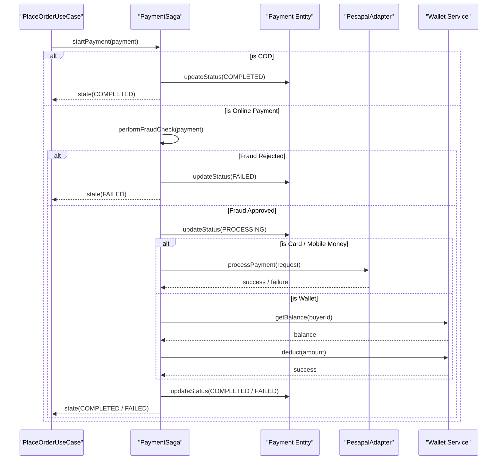

# Payment Saga Sequence

```mermaid
sequenceDiagram
    participant UC as "PlaceOrderUseCase"
    participant SAGA as "PaymentSaga"
    participant ENTITY as "Payment Entity"
    participant PESA as "PesapalAdapter"
    participant WALLET as "Wallet Service"

    UC->>SAGA: startPayment(payment)
    
    alt is COD
        SAGA->>ENTITY: updateStatus(COMPLETED)
        SAGA-->>UC: state(COMPLETED)
    else is Online Payment
        SAGA->>SAGA: performFraudCheck(payment)
        
        alt Fraud Rejected
            SAGA->>ENTITY: updateStatus(FAILED)
            SAGA-->>UC: state(FAILED)
        else Fraud Approved
            SAGA->>ENTITY: updateStatus(PROCESSING)
            
            alt is Card / Mobile Money
                SAGA->>PESA: processPayment(request)
                PESA-->>SAGA: success / failure
            else is Wallet
                SAGA->>WALLET: getBalance(buyerId)
                WALLET-->>SAGA: balance
                SAGA->>WALLET: deduct(amount)
                WALLET-->>SAGA: success
            end
            
            SAGA->>ENTITY: updateStatus(COMPLETED / FAILED)
            SAGA-->>UC: state(COMPLETED / FAILED)
        end
    end
```
